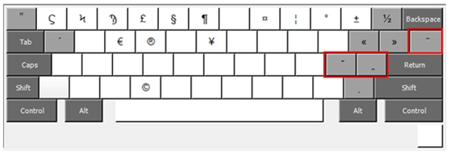
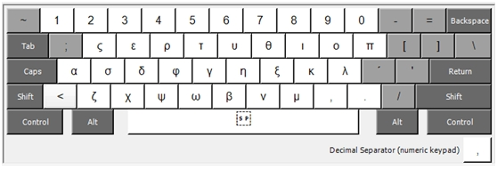

# Keyboard Layouts for Windows OS

Download the zip file and right click to unzip. There are instructions inside the zip of how to install and use the keyboard layouts.

- **Cypriot Greek Keyboard:** A keyboard layout that facilitates writing Cypriot Greek text. [Click here to download](https://github.com/themistocleous/Keyboard_Layouts/raw/master/CypriotGreekMonotonic.zip).

- **IPA Keyboard Layout:** A keyboard layout that facilitates writing texts with IPA symbols (mainly for Greek). [Click here to download](https://github.com/themistocleous/Keyboard_Layouts/blob/master/KeyboardLayout_IPAGreek.zip).

- **Keyboard for paleographers:** This keyboard layout includes special symbols used in paleography. [Click here to download](https://github.com/themistocleous/Keyboard_Layouts/blob/master/KeyboardLayout_Paleographic.zip).
